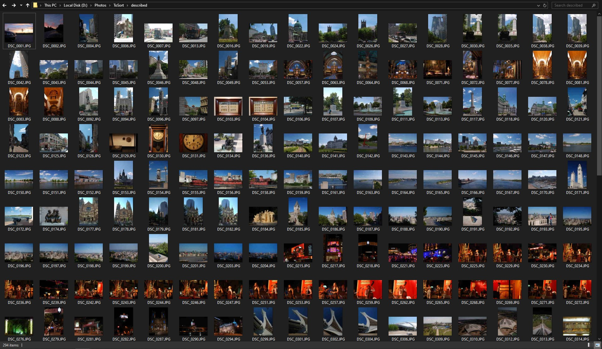
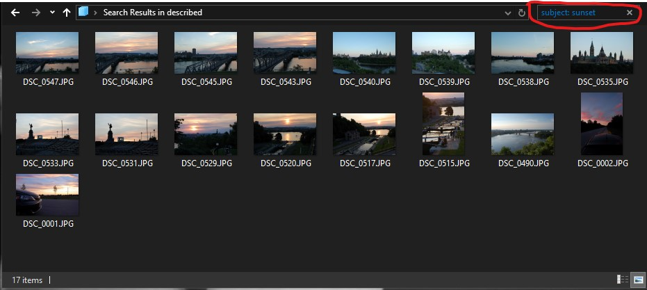
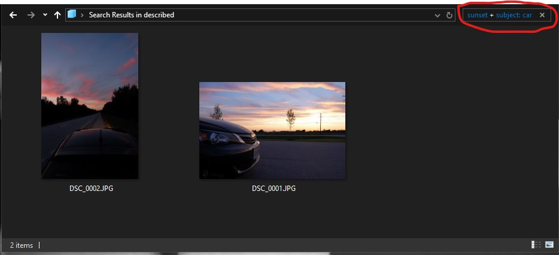

# AI assisted image description tool

A simple python script that embeds description of images into exif metadata based on AI generated subject and keywords. The keywords are generated using [Ollama.ai](https://ollama.ai) platform. 

## Benefits
There are two main benefits of this tool:
1. It runs completely locally on you computer, so no need for sending your photos to the cloud for processing, no need to pay LLM usage fees, no need to high bandwidth internet connection.
2. You can use Windows Explorer to search you photos based on those tags! Just type *Subject: \<your search keyword\>* in the Explorer's search box and it will filter the photos down to only ones that match the keyword. How cool is that!

## Usage

You must have [Ollama](https://ollama.ai) installed and you must pull the model(s) you want to use. The script expects the model already available locally. The default model is `gemma3:latest`

#### Running
I packaged the script as a convenient Windows executable file. You can download it and run as follows:
```
ai-image-desc-exif.exe \<operation\> \<path\> -output: [output_path] -model: [model]
```

If you want to run Python script directly, pull the repo to your local drive, install script dependencies from the `requirements.txt` file (exif and ollama):
```
pip install -r requirements.txt
```

and then run the following:
```
python ai-image-desc-exif.py \<operation\> \<path\> -output: [output_path] -model: [model]
```
#### Parameters
**operation**: `ask` or `update`

**path**: path to the image file or folder

**output_path**: path to write updated files to; if not provided, files would be renamed with `_edited` suffix (optional parameter)

**model**: LLM to use for the description, default is `gemma3:latest` (optional parameter)

## Notes
While the script does not overwrite the original files, it's good idea to have a backup first. I'm not responsible for any data loss.

I mostly tested with **llava:latest** (7 billion parameters) and **gemma3:latest** (4 billion parameters) models. In my opinion llava gives more generic descriptions, but it runs about 40% faster on my machine - 7.5 seconds per photo with gemma vs 4.4 seconds per photo with llava. My specs are Intel i7-4770 CPU, 32 Gb of RAM, NVIDIA GeForce GTX 1070 GPU with 8 Gb of VRAM.

This tool is inspired by [AI Renamer project](https://github.com/technovangelist/airenamer)

## Searching based on descriptions
In order to search for your photos based on the generated descriptions, you need to preface each keyword with *subject:*. For example, if you want to find all pictures of sunset among your vacation photos, type *subject: sunset* in the Windows File Explorer search box. If you want to narrow it down further, you can add another *subject: keyword* statement after a plus sign. For example search for *subject: sunset + subject: car* will return only photos that are showing cars at sunset. Added benefit - it can search in subfolders too!

### Unfiltered view


### subject: sunset


### subject: sunset + subject: car

